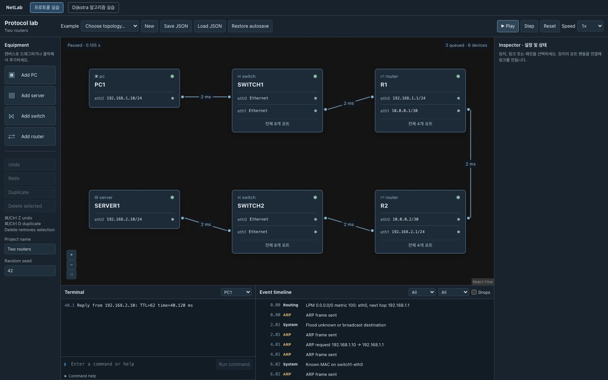

# NetLab

브라우저에서 네트워크를 만들고, 실제 논리적 프로토콜 처리를 따라가며 배우는 교육용 시뮬레이터입니다. PC·Server·Switch·Router의 포트를 연결하고 IP와 경로를 설정한 뒤 ARP → Ethernet Switching → IPv4 Routing → ICMP 응답을 관찰합니다.



## 실행

Node.js 22.12 이상과 npm 11을 사용하세요. 이 저장소의 기존 lockfile은 npm 11 기준입니다.

```bash
npm ci
npm run dev
# http://localhost:5173/netlab/
```

```bash
npm run build
npm run preview
```

서버·Docker·계정·API Key가 필요 없습니다. 제품은 실제 Socket, 외부 DNS 또는 AI API를 호출하지 않습니다. GitHub Pages의 기존 배포는 main 머지 시 갱신됩니다.

## 대표 실습

첫 화면은 두 Router 예제입니다.

1. Terminal의 기본 명령 `ping 192.168.2.10`을 **Run command**로 제출합니다.
2. **Play**로 실행하거나 **Step**으로 이벤트를 하나씩 진행합니다.
3. PC1의 응답에서 `TTL=62`를 확인합니다. 초기 TTL 64가 두 Router에서 감소한 결과입니다.
4. Timeline의 ARP·Routing 이벤트를 클릭해 헤더와 처리 이유를 확인합니다.
5. 장비를 선택해 ARP/MAC/Routing/TCP/NAT 테이블을 확인합니다.
6. Live failure controls에서 전원·Interface·Link를 끄고 다시 실행합니다.

배속은 가상 시간 진행 속도만 바꿉니다. **Reset**은 현재 프로젝트 설정에서 새 실행을 만듭니다. IP·Route·Topology 편집도 실행을 초기화합니다. Undo/Redo는 프로젝트 편집 이력이며 시뮬레이션 되감기가 아닙니다.

## 지원 기능

- React Flow 기반 포트 편집, 이동/삭제/복제, Zoom/Pan/Fit View, Undo/Redo
- Ethernet Unicast/Broadcast, MAC Learning, Unknown Unicast Flooding, ARP Retry/Cache
- IPv4 Connected/Static/Default Route, Longest Prefix Match, Gateway, TTL
- ICMP Ping, Time Exceeded, Destination Unreachable, ICMP 기반 Traceroute
- UDP Echo, TCP Handshake·UTF-8 Byte Sequence·ACK·재전송·정상 종료
- DHCP DORA·주소 예약·임대 갱신/만료·Pool Exhaustion
- DNS A Query/Response·Cache·NXDOMAIN와 최소 HTTP over TCP
- TCP/UDP/ICMP Echo PAT, 반환 변환, NAT Header Before/After
- Link Latency/Loss/Bandwidth/Queue, 장비 및 Interface/Link 장애
- 엔진의 실제 전송에 연결된 패킷 애니메이션과 불변 Header Inspector
- JSON 검증·저장·불러오기, IndexedDB 자동 저장과 수동 복구
- 한국어 학습 설명, 키보드 조작, Reduced Motion, 좁은 화면 패널

기존 **Dijkstra 알고리즘 실습**은 별도 모드로 유지합니다. 이 모드는 중앙 최단 경로 계산을 보여주며 실제 IP 라우팅과 구분됩니다. 모드를 바꿔도 프로토콜 실습의 편집 내용은 보존됩니다. [기존 모드 설명](docs/LEGACY_ALGORITHM_LAB.md).

## 예제와 명령

| 예제 | 확인할 동작 |
|---|---|
| Same LAN | ARP와 Switch MAC Learning |
| One router | Gateway와 서브넷 간 전달 |
| Two routers | 정적 경로, 독립적인 반환 경로, TTL |
| DHCP address lease | 자동 주소 할당과 임대 |
| DNS and web | 이름 조회 → TCP → HTTP 응답 |
| NAT / PAT | 사설 Client의 송신과 역변환 |

```text
help
ipconfig / ifconfig
arp
route
ping <IPv4 또는 이름>
traceroute <IPv4>
nslookup <이름>
udp-send <IPv4> <port> <text>
tcp-connect <IPv4> <port>
tcp-send <connection-id> <text>
tcp-close <connection-id>
http-get <이름>
dhcp
clear
```

Ping은 명령당 한 번 전송하며 Timeout은 가상 5초입니다. 명령은 OS Shell이 아닙니다.

## 엔진 구조

```text
UI → Application → Core
          ↓
        Storage
```

- Core는 React·DOM·Zustand를 import하지 않는 TypeScript입니다.
- 우선순위 큐는 정수 마이크로초와 삽입 순서로 정렬됩니다.
- 고정 Seed와 같은 입력은 같은 프로토콜 Trace를 만듭니다.
- Router는 자신의 Routing Table과 ARP Cache로 다음 Hop을 선택합니다.
- Runtime Cache/Connection/Lease와 저장할 Document를 분리합니다.
- Trace Header는 복사하여 과거 기록이 이후 NAT/TTL 변경에 오염되지 않습니다.
- Frame마다 전체 앱을 재렌더하지 않도록 화면 Snapshot 갱신을 제한합니다.

[전체 Architecture](ARCHITECTURE.md) · [연구와 기술 선택](RESEARCH.md) · [검증 계획](TEST_PLAN.md)

## 검증

```bash
npm run typecheck
npm run lint
npm run check:core
npm test
npx playwright install chromium
npm run test:e2e
npm run test:performance
```

PR CI는 위 품질 검사, production build, Chromium 사용자 흐름을 실행합니다. Browser 실패 Trace와 Screenshot을 Artifact로 보관합니다. 테스트 수와 실제 결과는 [통합 검증 보고서](docs/phases/protocol-integration.md)에 기록합니다.

100개 장비·150개 링크와 Ping 20개를 사용하는 [브라우저 측정](docs/evidence/browser-performance.json), [재현 스크립트](scripts/browser-evidence.mjs)를 제공합니다. 측정은 Headless Chromium/Apple M3 Max 기준이며 다른 Hardware의 성능을 보장하지 않습니다.

## 저장 형식

`.netlab.json`으로 사용할 수 있는 schemaVersion 1 JSON입니다. 장비, Interface, Static Route, DHCP/DNS/NAT 설정, 링크 조건, 위치, Seed를 저장합니다. Runtime ARP/MAC Cache, TCP Connection, Lease, Event Queue는 저장하지 않습니다. **Restore autosave**로 이 브라우저의 마지막 자동 저장을 불러옵니다.

잘못된 버전, 중복 ID, 잘못된 IP/Prefix, 점유된 포트, L2 Loop와 손상된 참조를 거부하며 현재 프로젝트를 보존합니다.

## 교육적 단순화

실제 Router OS나 RFC의 byte-level 구현이 아닙니다.

- IPv4만 지원하며 Fragmentation·VLAN·STP·동적 라우팅은 제외합니다. L2 Loop는 실행 전에 차단합니다.
- TCP는 Stop-and-Wait 모델입니다. Congestion Control, Receive Window, Sequence Wrap, Simultaneous Open, 일반적인 Half-close API는 제외합니다.
- DHCP는 같은 Ethernet 영역과 첫 번째 DHCP Interface를 대상으로 하며 갱신도 DORA로 단순화합니다. Relay는 없습니다.
- DNS는 고정 60초 Cache의 A Record이며 실제 인터넷 조회는 없습니다. `.local`은 이 가상 실습의 Unicast DNS 이름으로 사용하며 실제 mDNS와 다릅니다.
- DHCP/DNS는 실제 UDP 전달 안에 교육용 JSON Payload를 담습니다.
- PAT는 직접 연결된 Inside Subnet과 Endpoint별 Mapping을 사용합니다. Hairpin, Port Forwarding, 인용된 ICMP Error Header 변환은 제외합니다.
- Header 크기와 Link Serialization은 교육용 모델이며 정확한 Ethernet Wire Encoding은 아닙니다.
- Timeline은 최근 10,000개 기록을 보관하고 화면은 필터 결과 최근 500개를 표시합니다.

[네트워크 모델](docs/protocols/network.md) · [서비스 모델](docs/protocols/services.md) · [저장 규칙](docs/protocols/persistence.md)

## 개발 기록

[Roadmap](ROADMAP.md) · [개발 로그와 PR](DEVELOPMENT_LOG.md) · [설계 결정](docs/adr/) · [독립 리뷰](docs/reviews/)

기본 Branch는 보호된 `main`이며, 변경은 PR과 CI를 통해 머지합니다. AI API·백엔드·추가 클라우드 기능은 현재 범위가 아닙니다.
