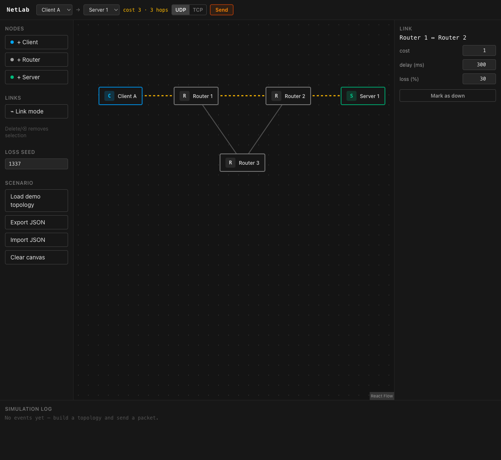

> Archived description of the original algorithm teaching mode. The current protocol workspace and scope are documented in the root README.

# Legacy Dijkstra algorithm lab

**NetLab is an interactive network simulator for learning how routing and transport protocols actually behave.** Place clients, routers, and servers on a canvas, wire them together, and watch packets travel the shortest path in real time. Break a link and see routes recalculate instantly; crank up packet loss and compare how UDP shrugs while TCP fights back with retransmissions. Everything runs in the browser — no backend, no real sockets, just a faithful-enough model of the ideas.



## Features

- **Topology editor** — add/drag/delete Client, Router, and Server nodes; connect them in link mode; edit per-link cost, delay, and loss rate
- **Shortest-path routing** — Dijkstra over link costs, with the active path highlighted and animated on the canvas
- **Routing tables** — click any router to see its destination → next-hop table, recomputed live on every topology change
- **Failure simulation** — toggle any node or link down; routes and routing tables update immediately, and packets already in flight are dropped where they stand
- **Packet loss** — per-link loss rate with a seeded RNG (`mulberry32`), so the same seed reproduces the same loss pattern
- **UDP vs TCP** — UDP is fire-and-forget; TCP is a stop-and-wait model with reverse-path ACKs, per-seq timeouts, and up to 3 retransmissions — each retransmit recomputes the route, so TCP recovers even when its original path dies mid-transfer
- **Simulation log** — timestamped record of every send, delivery, loss, timeout, retransmission, and failure
- **Scenarios** — auto-saved to localStorage, JSON export/import, one-click demo topology

## Tech stack

- Vite + React 19 + TypeScript (strict)
- [React Flow](https://reactflow.dev/) (`@xyflow/react`) for the canvas
- Zustand for state (selector subscriptions matter — the simulation updates state every animation frame)
- Tailwind CSS v4
- Vitest for the algorithm/engine unit tests

No backend. `src/engine/` and `src/algorithms/` are React-free TypeScript, ready to be lifted into a Node.js server if scenario sharing ever becomes a feature.

## Running

```bash
npm install
npm run dev     # http://localhost:5173
npm run test    # algorithm + engine unit tests
npm run build
```

## Network concepts, briefly

### What routing is

Every router keeps a table answering one question per destination: *which neighbor do I hand this packet to next?* Nobody plans the full journey — each hop makes one local decision, and the chain of local decisions forms the path.

### How Dijkstra fills that table

For a router R, Dijkstra explores the graph outward from R, always expanding the cheapest unvisited node, until it knows the minimum total cost to every destination. The routing table entry for destination D is simply **the first hop on the cheapest path from R to D**. NetLab recomputes this from scratch on every topology change — real networks converge to the same answer with distributed protocols (OSPF, IS-IS) instead of a central computation.

Failure handling falls out of the model for free: a downed node or link is *excluded from the graph* before Dijkstra runs, so "recalculating after failure" is the same code path as calculating in the first place.

### TCP vs UDP — and what this model simplifies

**UDP** sends a datagram and forgets it. Lost is lost. That's not a defect — it's the contract, and it's why UDP suits latency-sensitive traffic where a late retransmission is worthless.

**TCP** promises delivery, and NetLab models the minimal machinery that makes the promise credible:

- the receiver ACKs each data packet back along the reverse path
- the sender times out (path round-trip delay × 2 + 500 ms) and retransmits the same seq
- after 3 failed retries it gives up and reports a failed connection

**Honest list of what is simplified away:** no 3-way handshake, no sliding window (this is stop-and-wait: one packet in flight, ever), no congestion control, no flow control, no checksums, no byte streams — packets are opaque units. Real TCP's genius is in exactly the parts omitted here; what remains is the core *reliability loop* (ACK → timeout → retransmit), which is the right first thing to understand.

One emergent lesson the model teaches honestly: at 50% link loss, stop-and-wait with 3 retries fails most transfers (~68%) — each attempt must survive the lossy link twice, once for data and once for the ACK. Watch the log and see why real TCP needed more sophisticated recovery.

## Demo walkthrough

Click **Load demo topology** (left panel, or the empty-canvas button):

```
Client A ── Router 1 ══ Router 2 ── Server 1      ══ direct, cost 1
                 \         /
                  Router 3                         detour, cost 2+2
```

1. Select `Client A → Server 1`, send **UDP** — the packet animates along the direct path, log reads `delivered`.
2. Click **Router 1** — its routing table shows `Server 1 → next hop Router 2`.
3. Select the Router 1↔Router 2 link, set **loss 30%**, send UDP a few times — some packets die mid-link with a red ✕ and nothing else happens. That silence is UDP.
4. Switch to **TCP**, send — watch lost packets trigger timeouts and retransmissions until all 3 seqs are ACKed. (Try 50% loss to watch stop-and-wait break down.)
5. **Mark the Router 1↔Router 2 link down** — Router 1's table instantly flips to `next hop Router 3`.
6. Send again — packets take the detour. If you kill the link *mid-transfer*, TCP's next retransmission reroutes automatically.

## Roadmap (deliberately not built yet)

- BFS (hop count) and Bellman-Ford as selectable algorithms — the weight function is already pluggable
- Simulation speed slider, pause/step execution
- Congestion model (bandwidth, queueing)
- More scenario presets
- Backend (Node.js/Fastify) for scenario sharing — the engine is already portable

## Project layout

```
src/
├── algorithms/   # React-free: graph build, Dijkstra, routing tables (+ tests)
├── engine/       # React-free: rAF loop, packet physics, TCP state machine, RNG (+ tests)
├── store/        # Zustand: useNetworkStore (topology), useSimulationStore (packets/logs)
├── features/     # canvas, tool panel, property panel, transfer controls, log view
├── types/        # domain models
└── utils/        # scenario save/load/export
```

The `engine/` and `algorithms/` directories never import React — that boundary is what keeps the simulation unit-testable and server-portable.
